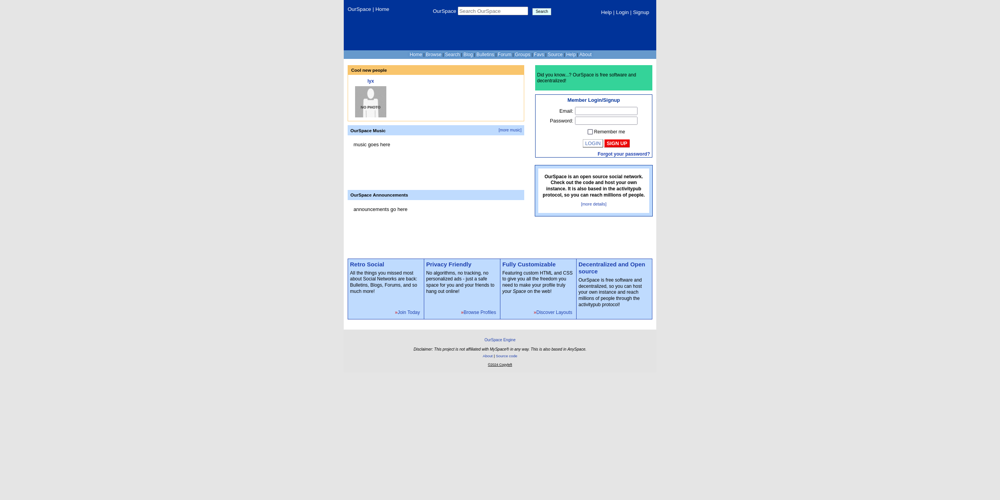

<br>

<div align="center">
  <h3 align="center">OurSpace</h3>

  <p align="center">A decentralised clone of MySpace based in the ActivityPub protocol.</p>
</div>

<details>
  <summary>Table of Contents</summary>

  <ol>
    <li>
      <a href="#about-the-project">About The Project</a>
      <ul>
        <li><a href="#built-with">Built With</a></li>
      </ul>
    </li>
    <li>
      <a href="#getting-started">Getting Started</a>
      <ul>
        <li><a href="#prerequisites">Prerequisites</a></li>
        <li><a href="#installation">Installation</a></li>
      </ul>
    </li>
    <li>
      <a href="#todo">TODO</a>
    </li>
  </ol>
</details>

## About The Project



**OurSpace** is a decentralised social networking platform inspired by the early concepts of MySpace but built using the ActivityPub protocol for enhanced privacy and interoperability. The goal of OurSpace is to provide users with a space to express themselves, share content, and connect with others in a federated environment that prioritises user privacy and data ownership.

### Built With

- 
- 
- 

## Getting Started

OurSpace is meant to be easy to set up and run on your own server. Below are the steps to get started with OurSpace.

### Prerequisites

To use OurSpace we need to have installed PHP 8.2 or later and Redis. We can install them in a Debian-based system with the following commands:

```bash
sudo apt update
sudo apt install nginx mysql-server php php-fpm php-mbstring php-xml php-bcmath php-curl php-redis redis nginx zip unzip composer nodejs npm
```

Now, enable nginx, mysql and php-fom services:

```bash
sudo systemctl enable --now nginx mysql php-fpm redis-server
```

Create a database for OurSpace:

```bash
mysql
CREATE DATABASE ourspace;
CREATE USER 'ourspace_user'@'localhost' IDENTIFIED BY 'password';
GRANT ALL ON ourspace.* TO 'ourspace_user'@'localhost';
FLUSH PRIVILEGES;
EXIT;
```

### Installation

Once you have all the required software installed and the database created, you can proceed to install OurSpace. First, clone the repository:

```bash
cd /var/www/html
git clone https://github.com/0xd011f4ce/OurSpace
```

Now, edit the `.env` file with your database, redis, and mail credentials. You can copy the `.env.example` file to `.env` and edit it with your favourite text editor.

Install all the dependencies:

```bash
composer install
npm install
```

Now, create the key and run the migrations:

```bash
php artisan key:generate
php artisan migrate
```

Build the styles:

```bash
npm run build
```

Give the proper permissions:

```bash
chown -R www-data:www-data /var/www/html/OurSpace
chmod -R 755 /var/www/html/OurSpace
```

Now, create a virtual host for OurSpace. You can create a file in `/etc/nginx/sites-available/ourspace.conf` with the following content:

```nginx
server {
    listen 80;
    server_name ourspace.lat;
    root /var/www/html/OurSpace/public;

    add_header X-Frame-Options "SAMEORIGIN";
    add_header X-XSS-Protection "1; mode=block";
    add_header X-Content-Type-Options "nosniff";

    index index.html index.htm index.php;

    charset utf-8;

    location / {
        try_files $uri $uri/ /index.php?$query_string;
    }

    location = /favicon.ico { access_log off; log_not_found off; }
    location = /robots.txt  { access_log off; log_not_found off; }

    error_page 404 /index.php;

    location ~ \.php$ {
        fastcgi_pass unix:/var/run/php/php8.1-fpm.sock;
        fastcgi_index index.php;
        fastcgi_param SCRIPT_FILENAME $realpath_root$fastcgi_script_name;
        include fastcgi_params;
    }

    location ~ /\.(?!well-known).* {
        deny all;
    }
}
```

And we need another one for serving Laravel Reverb. We can create it in `/etc/nginx/sites-available/ws.conf` with the following content:

```nginx
server {
    listen 80;
    server_name ws.ourspace.lat;
    root /var/www/html/ourspace/public;

    location /app {
    	proxy_http_version 1.1;
        proxy_set_header Host $http_host;
        proxy_set_header Scheme $scheme;
        proxy_set_header SERVER_PORT $server_port;
        proxy_set_header REMOTE_ADDR $remote_addr;
        proxy_set_header X-Forwarded-For $proxy_add_x_forwarded_for;
        proxy_set_header Upgrade $http_upgrade;
        proxy_set_header Connection "Upgrade";
        proxy_read_timeout 300s;
        proxy_connect_timeout 75s;


        proxy_pass http://127.0.0.1:8080;
    }
}
```

Enable the config:

```bash
sudo ln -s /etc/nginx/sites-available/ourspace.conf /etc/nginx/sites-enabled/
sudo ln -s /etc/nginx/sites-available/ws.conf /etc/nginx/sites-enabled/
```

Restart nginx:

```bash
sudo systemctl restart nginx
```

Now link the storage to the public folder and install the dependencies for reverb:

```bash
php artisan storage:link
php artisan install:broadcasting
```

Now, we need to create three services to handle the jobs that OurSpace needs to run, another to handle the notifications' queue and another one to run Laravel Reverb. So run something `emacs /lib/systemd/system/ourspace-queue.service`, `emacs /lib/systemd/system/ourspace-notifications.service`, `emacs /lib/systemd/system/ourspace-ws.service` and add the following content:

```ini
# /lib/systemd/system/ourspace-queue.service
[Unit]
Description=OurSpace queue worker

[Service]
User=www-data
Group=www-data
Restart=on-failure
ExecStart=/usr/bin/php /var/www/html/ourspace/artisan queue:work --daemon --env=production --queue=ap

[Install]
WantedBy=multi-user.target
```

```ini
# /lib/systemd/system/ourspace-notifications.service
[Unit]
Description=OurSpace notifications worker

[Service]
User=www-data
Group=www-data
Restart=on-failure
ExecStart=/usr/bin/php /var/www/html/ourspace/artisan queue:work --daemon --env=production

[Install]
WantedBy=multi-user.target
```

```ini
# /lib/systemd/system/ourspace-ws.service
[Unit]
Description=OurSpace WebSockets	Service

[Service]
User=www-data
Group=www-data
Restart=on-failure
ExecStart=/usr/bin/php /var/www/html/ourspace/artisan reverb:start

[Install]
WantedBy=multi-user.target
```

Now reload the systemd daemon:

```bash
sudo systemctl daemon-reload
```

Finally, enable and start both services, and your OurSpace instance will be ready to be used!

Aditionally, if you want to start multiple instances of the queue workers (which is ideal) you can name the service like `/lib/systemd/system/ourspace-queue@.service` and you can enable and manage them like this:

```bash
sudo systemctl enable ourspace-queue\{1..6} # enables 6 services
sudo systemctl start ourspace-queue\{1..6} # starts 6 services
```

## TODO:

For a list of planned features and improvements, please refer to the [TODO](TODO.md) file.
