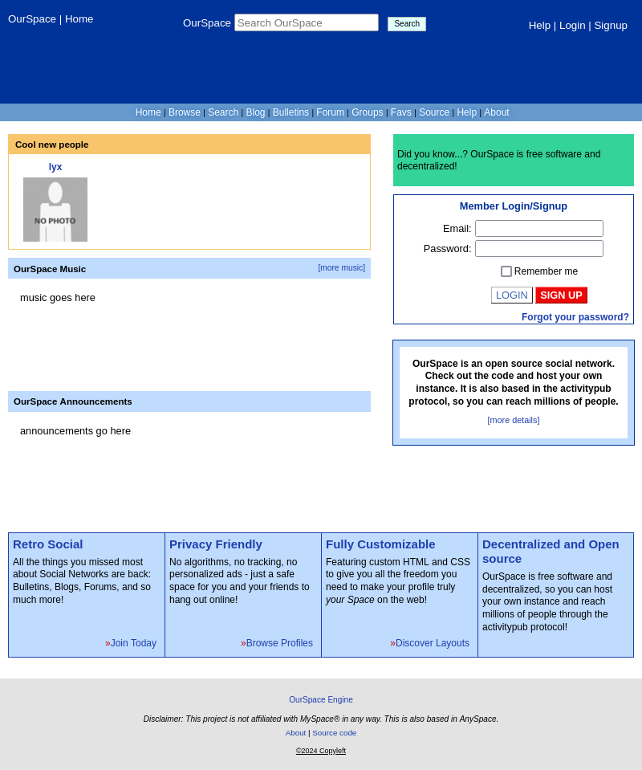

# OurSpace

OurSpace is supposed to work like a clone of MySpace while being completely decentralised (based in the activitypub protocol).

Notice that the styles were taken from [AnySpace](https://anyspace.3to.moe/about.php)

## Overview

## TODO:

- [-] Activitypub
    - [x] Accounts
    - [-] Posts
        - [x] Local posts should be federated
        - [x] Local posts should be deleted
        - [x] Remote posts should be fetched
        - [x] Remote posts should be deleted
    - [x] Follows
        - [x] I cannot follow myself
        - [ ] Check when waiting for approval
    - [ ] Likes
    - [ ] Comments

- [-] Social features
    - [x] Profile
        - [ ] Show when the user is online
        - [ ] Set mood
        - [x] Set interests
        - [x] Update profile picture
        - [ ] Mark account as private (in federation manual approval is needed)
        - [ ] Allow custom CSS
        - [ ] Profile audio
    - [x] Friends (they are known as follows in the activitypub protocol)
        - [x] Add friends
        - [x] Remove friends
    - [x] Posts (everything should be federated)
        - [x] Create posts
        - [ ] Delete posts
        - [ ] Like posts
        - [ ] Comment posts
    - [ ] Blog
    - [ ] Bulletin
    - [ ] Groups
    - [ ] Forum
    - [ ] Events
    - [ ] Add users to favourites
    - [ ] Chat

- [ ] Others
    - [ ] Music
    - [ ] Announcements
